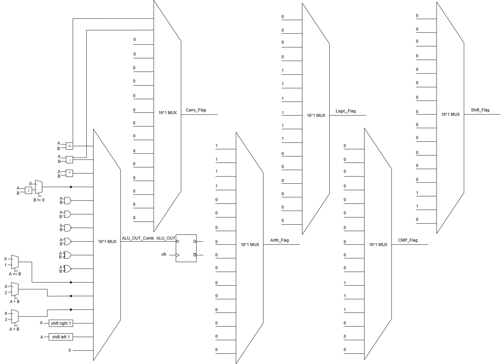

Description:
This repository contains a 16-bit Arithmetic Logic Unit (ALU) implemented in Verilog.
The ALU supports a wide range of arithmetic, logic, comparison, and shift operations based on a 4-bit control input (ALU_FUN). It also generates operation-specific flags and a carry flag for arithmetic operations.

Features
•	Arithmetic operations: Addition, subtraction, multiplication, division
•	Logic operations: AND, OR, NAND, NOR, XOR, XNOR
•	Comparison operations: Equality, greater than, less than
•	Shift operations: Logical left shift, logical right shift
•	Status Flags:
o	Carry_Flag – Set during arithmetic operations that generate a carry/borrow
o	Arith_Flag – High during arithmetic operations
o	Logic_Flag – High during logic operations
o	CMP_Flag – High during comparison operations
o	Shift_Flag – High during shift operations

Module: ALU_16_bit
Inputs
•	A [15:0] – First operand
•	B [15:0] – Second operand
•	ALU_FUN [3:0] – Control signal selecting operation
•	clk – Positive-edge triggered clock
Outputs
•	ALU_OUT [15:0] – Result of the selected operation
•	Carry_Flag – Carry flag (for addition/subtraction)
•	Arith_Flag – Arithmetic operation indicator
•	Logic_Flag – Logic operation indicator
•	CMP_Flag – Comparison operation indicator
•	Shift_Flag – Shift operation indicator

Operations (Based on ALU_FUN)
•	0000 → Addition (A + B)
•	0001 → Subtraction (A - B)
•	0010 → Multiplication (A * B)
•	0011 → Division (A / B) (returns 0 if divisor = 0)
•	0100 → AND
•	0101 → OR
•	0110 → NAND
•	0111 → NOR
•	1000 → XOR
•	1001 → XNOR
•	1010 → Equality comparison (A == B)
•	1011 → Greater than comparison (A > B)
•	1100 → Less than comparison (A < B)
•	1101 → Logical right shift (A >> 1)
•	1110 → Logical left shift (A << 1)
•	1111 → Default (outputs 0)

Notes
•	Division by zero is handled safely by returning 0.
•	Flags ensure easy identification of the executed operation category.

A detailed testbench is included.

It covers:  
• Arithmetic operations  
• Division by zero handling  
• Logical bitwise operations  
• Comparisons (equality, greater than, less than)  
• Shift operations  
• Default case  

Simulation results are logged using $display statements and waveform dumping for verification.

Synthesis Diagram
•	The block diagram of the ALU is shown below.  
*(Created manually using [draw.io](https://app.diagrams.net))*

